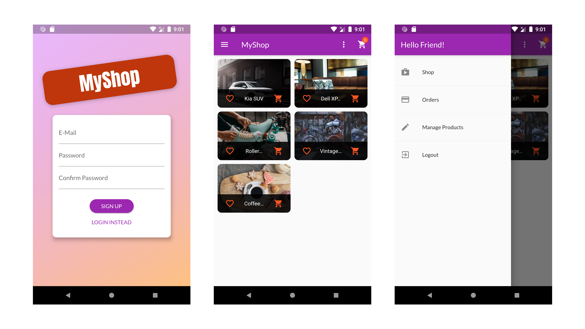
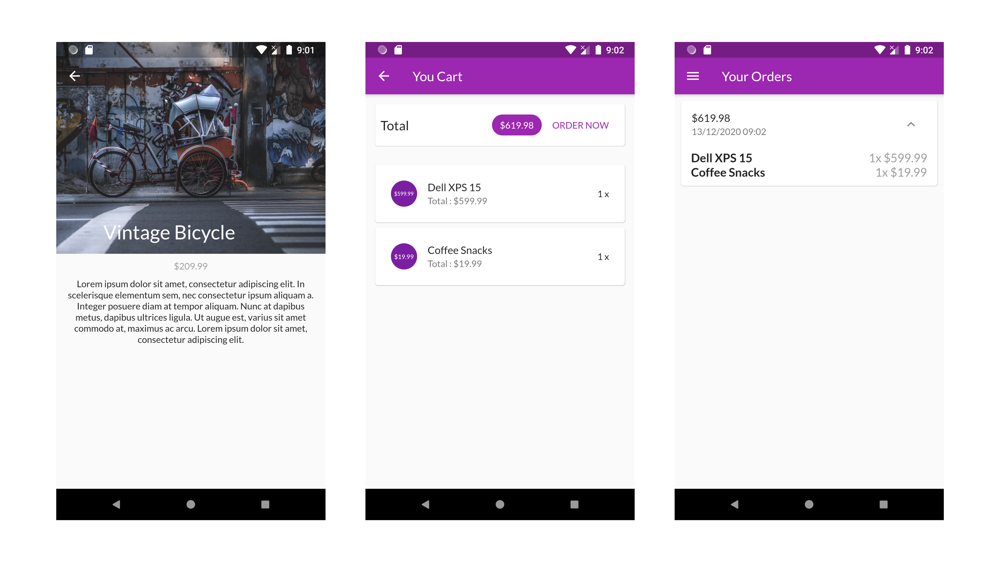
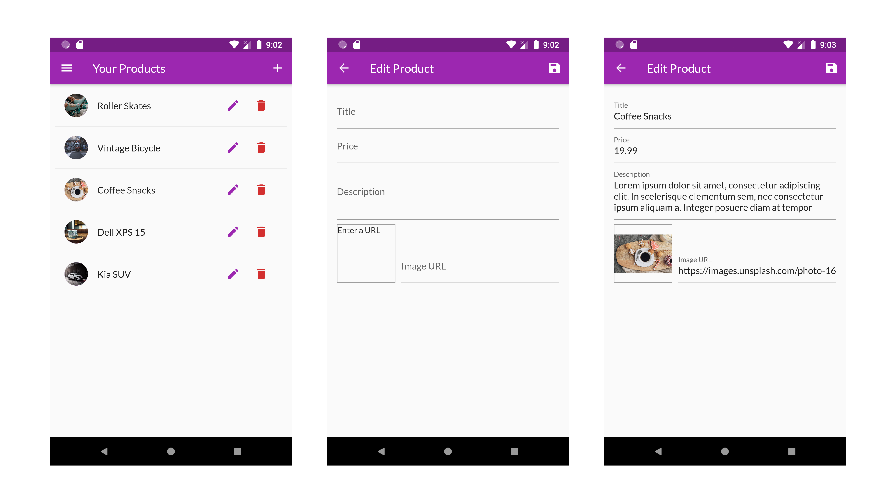

# Shop-App
Welcome Guys! This repo consists of my code for Shop App made using Flutter, which I made as a part of my course, Flutter & Dart: The Complete Guide. I have attached some screenshots of the Application as a Reference. Make sure to leave me some Feedback.  

# Features
- Use of Basic Flutter Widgets
- Use of widgets like Row, Column, ListView etc
- Theming the App
- Use of Navigation Widgets such as Drawer, etc
- Pushing & Popping Pages for Navigation
- Use of Provider for State Management
- Included forms for better User Interaction
- Used HTTP Module for sending HTTP requests
- Integrated Firebase for Backend
- Used Realtime Database for storing the Data
- Included Authentication using Firebase, and added autoLogin functionality
- Animations using AnimatedContainer, Hero, Slivers & much more
  

  
I'll be waiting for your precious feedback.  
Happy Coding :)

